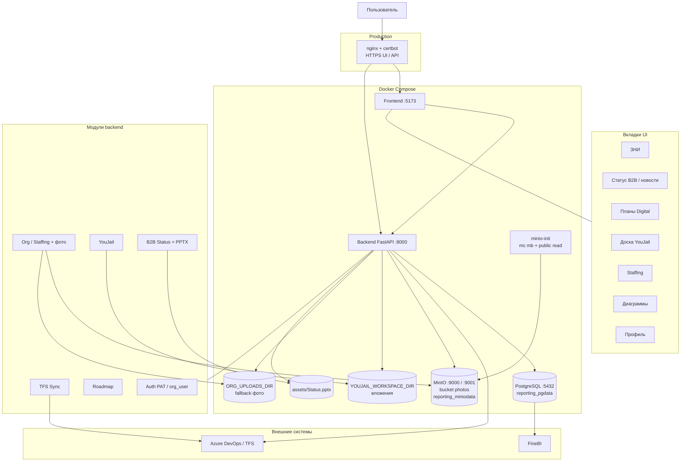
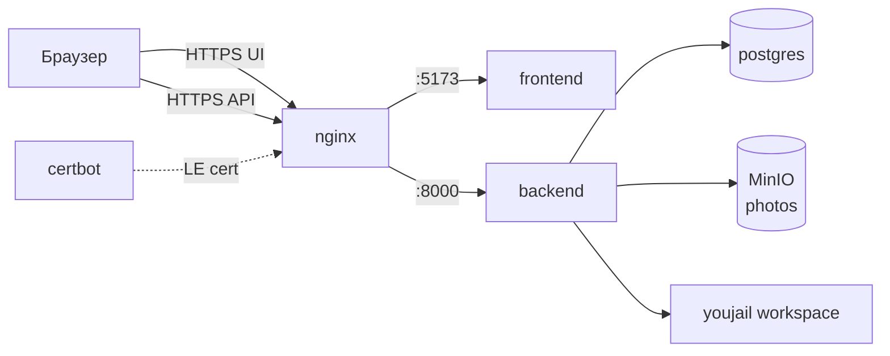
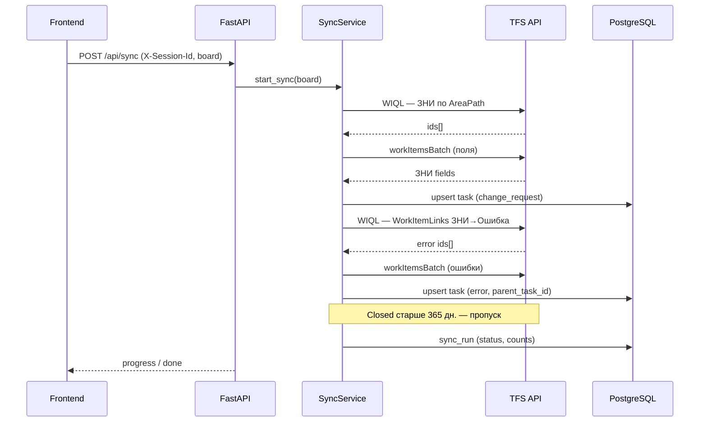
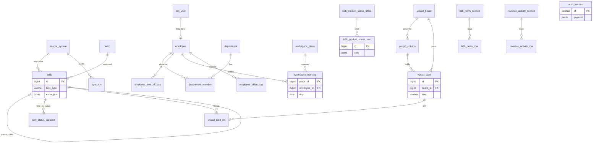
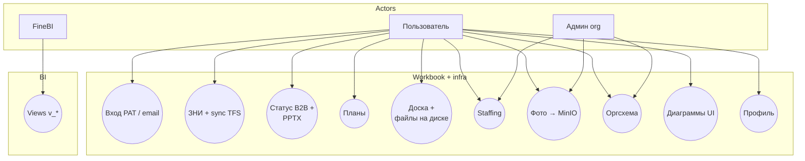
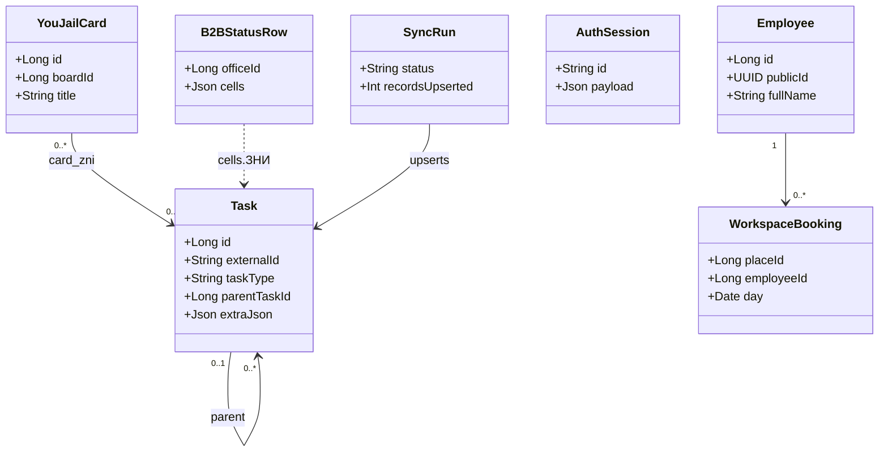
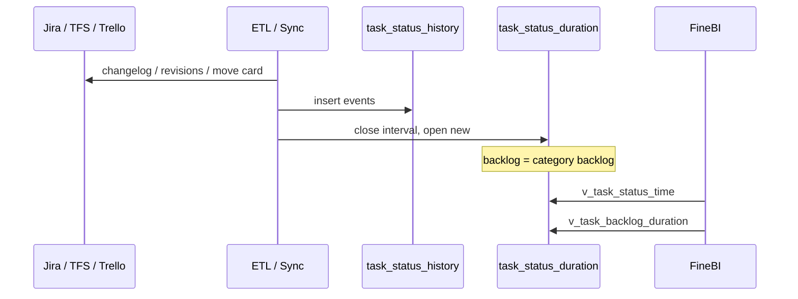
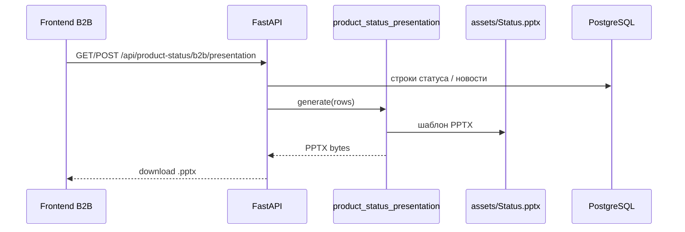
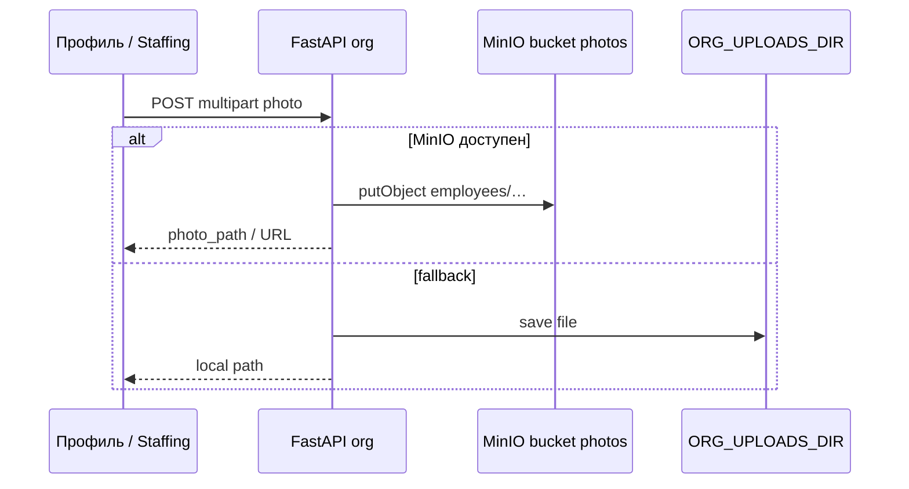

# Диаграммы проекта reporting

Все схемы в одном месте.

| Для чего | Куда |
|----------|------|
| **Вставка в Confluence** | [confluence.md](confluence.md) + картинки [diagrams/png/](diagrams/png/) |
| Просмотр на GitHub (Mermaid) | этот файл |
| Исходники PlantUML | [plantuml/](../plantuml/) |
| SVG | [diagrams/svg/](diagrams/svg/) |

**Прямая ссылка (GitHub):** [docs/diagrams.md](https://github.com/volchonok16/reporting/blob/main/docs/diagrams.md)

| Раздел | Тип | Исходник |
|--------|-----|----------|
| [Архитектура](#архитектура) | Mermaid | [plantuml/architecture.puml](../plantuml/architecture.puml) |
| [Production](#production-nginx--certbot) | Mermaid | [deploy/DEPLOY.md](../deploy/DEPLOY.md) |
| [Синхронизация TFS](#синхронизация-tfs-зни) | Mermaid | backend `sync_service.py` |
| [ER — база данных](#er--база-данных) | Mermaid | [plantuml/database-er.puml](../plantuml/database-er.puml) |
| [Use Case](#use-case) | Mermaid | [plantuml/use-case.puml](../plantuml/use-case.puml) |
| [Классы](#диаграмма-классов) | Mermaid | [docs/uml-diagram.md](uml-diagram.md) |
| [Поток данных](#поток-данных-время-в-статусе) | Mermaid | [docs/uml-diagram.md](uml-diagram.md) |
| [PlantUML (детальные SVG)](#plantuml--детальные-диаграммы) | SVG | генерируются при push / локально |

---

## Архитектура

Workbench: **ЗНИ**, **Статус продукта B2B** (+ PPTX), **Планы Digital**, **Доска YouJail**, **Staffing**, **Диаграммы**.  
Инфраструктура Compose: **PostgreSQL**, **MinIO** (фото), диск **YOUJAIL_WORKSPACE_DIR**, шаблон **Status.pptx**.



| Компонент | Назначение |
|-----------|------------|
| PostgreSQL | Все доменные таблицы (ЗНИ, org, YouJail, B2B), `auth_session`, sync |
| MinIO | S3-совместимое хранилище фото (`MINIO_BUCKET=photos`) |
| minio-init | Создаёт bucket и anonymous download |
| `YOUJAIL_WORKSPACE_DIR` | Файлы/вложения/worktree доски |
| `ORG_UPLOADS_DIR` | Локальный fallback, если MinIO недоступен |
| `assets/Status.pptx` | Шаблон генерации презентаций B2B |
| FineBI | Чтение views `v_*` из PostgreSQL |

---

## Production: nginx + certbot



Стек на хосте: Docker Compose (`postgres`, `backend`, `frontend`, `minio`, `minio-init`) + nginx + certbot.  
Запуск: `sudo bash scripts/production.sh` · [deploy/DEPLOY.md](../deploy/DEPLOY.md) · MinIO/env: [docker.md](docker.md)

---

## Синхронизация TFS (ЗНИ)

Оптимизированный поток (без тяжёлого `$expand`):



**Доски:** Digital, Продукты, Reports, B2B Product (CORE, КАТС, Voice, M2M, SMS, Solar, Umnico), BE Analytics, ESB. Фильтр «Все доски» — объединение.

---

## ER — база данных

Ядро задач + Staffing + YouJail + B2B (полная PlantUML: [database-er.puml](../plantuml/database-er.puml)).



Глоссарий: [glossary.md](glossary.md) · обзор таблиц: [database-overview.md](database-overview.md)

---

## Use Case



Подробная таблица: [use-case-diagram.md](use-case-diagram.md)

---

## Диаграмма классов



---

## Поток данных: время в статусе



### Генерация PPTX (Статус продукта B2B)



### Фото сотрудника (MinIO)



---

## PlantUML — детальные диаграммы

Детальные схемы. **SVG** обновляются при push в `main` (GitHub Actions) или локально:

```bash
docker run --rm -v "$(pwd):/work" -w /work plantuml/plantuml \
  -tsvg -o /work/docs/diagrams/svg \
  /work/plantuml/database-er.puml \
  /work/plantuml/architecture.puml \
  /work/plantuml/use-case.puml
```

| Диаграмма | SVG (в репозитории) | Исходник |
|-----------|---------------------|----------|
| ER база данных | [database-er.svg](diagrams/svg/database-er.svg) | [database-er.puml](../plantuml/database-er.puml) |
| Архитектура | [architecture.svg](diagrams/svg/architecture.svg) | [architecture.puml](../plantuml/architecture.puml) |
| Use Case | [use-case.svg](diagrams/svg/use-case.svg) | [use-case.puml](../plantuml/use-case.puml) |

> Если SVG ещё не сгенерированы — откройте любой `.puml` на [plantuml.com/plantuml](https://www.plantuml.com/plantuml/uml) или дождитесь workflow **Render diagrams**.

### Просмотр без GitHub

1. **В репозитории** — этот файл (`diagrams.md`), Mermaid рисуется сам.
2. **PlantUML онлайн** — скопировать текст из `plantuml/*.puml` → [plantuml.com](https://www.plantuml.com/plantuml/uml).
3. **Локально** — см. [plantuml/README.md](../plantuml/README.md).
