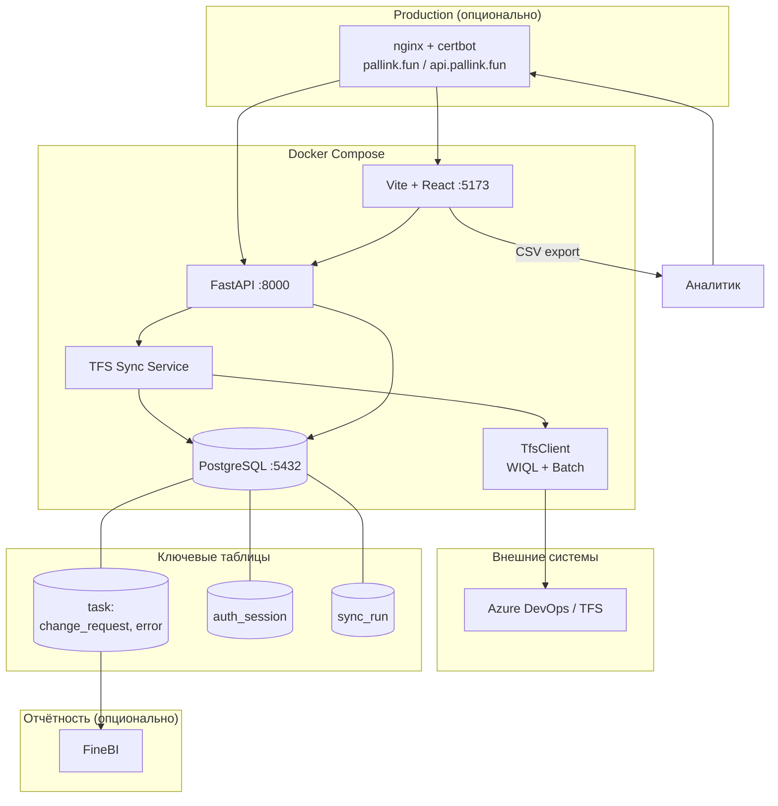
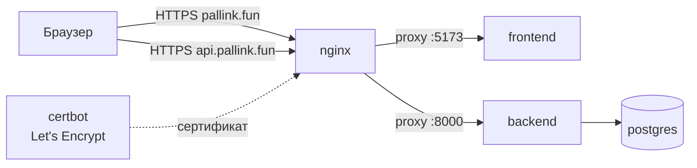
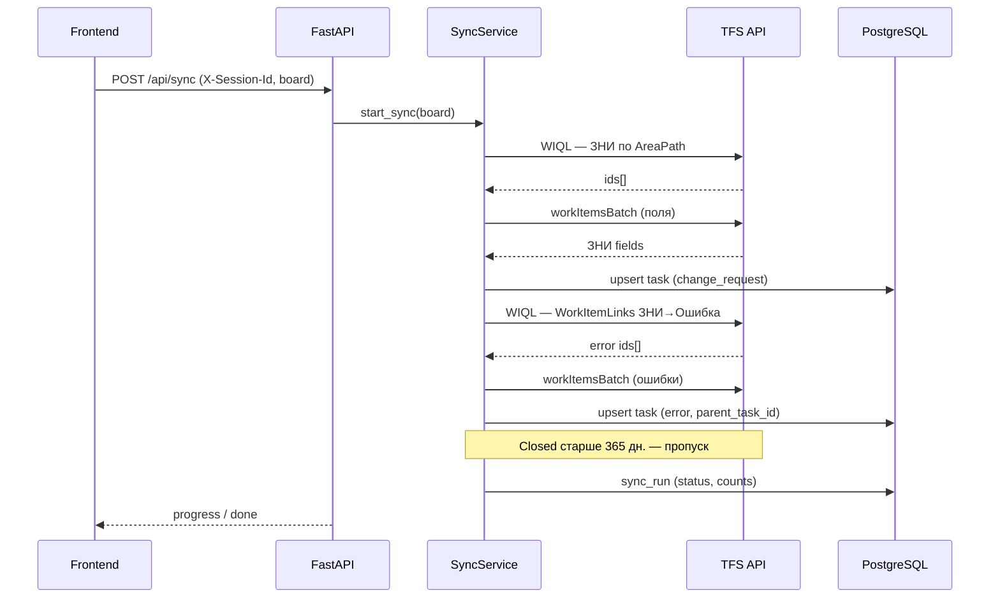
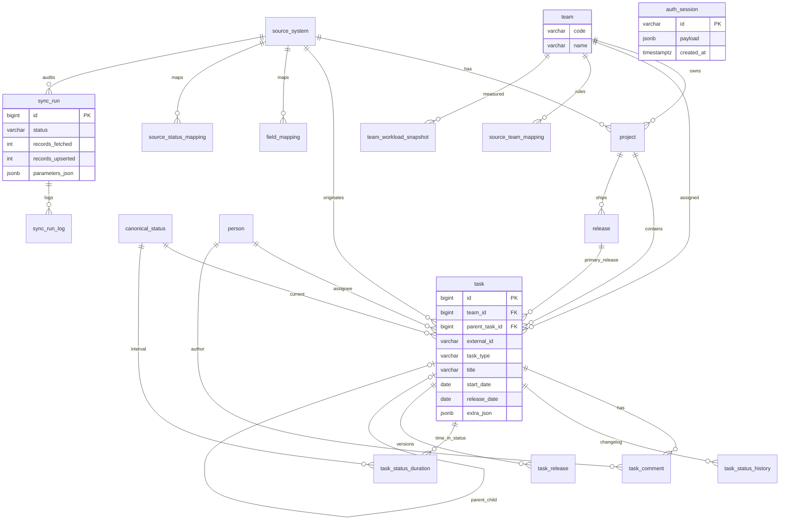
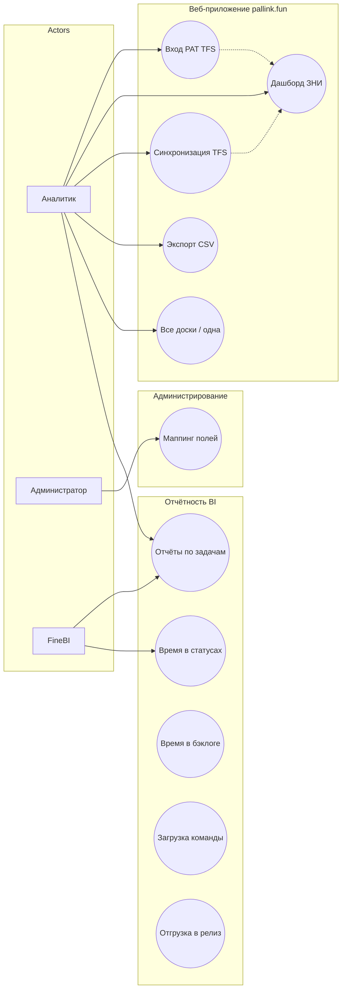
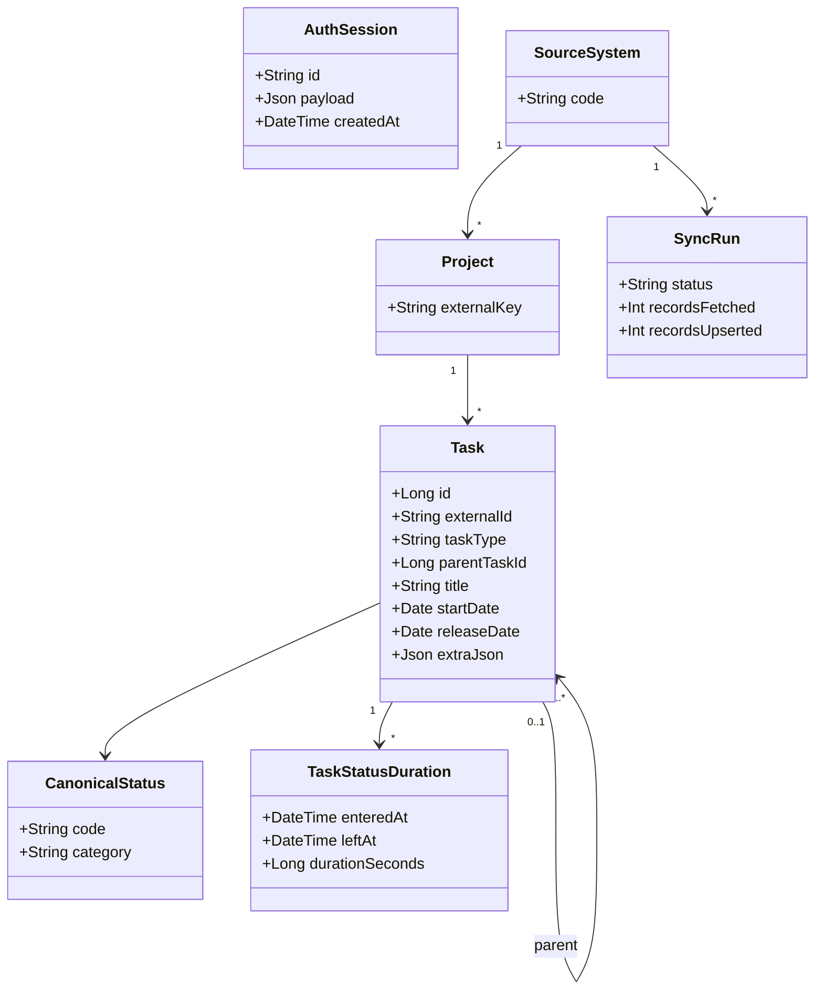
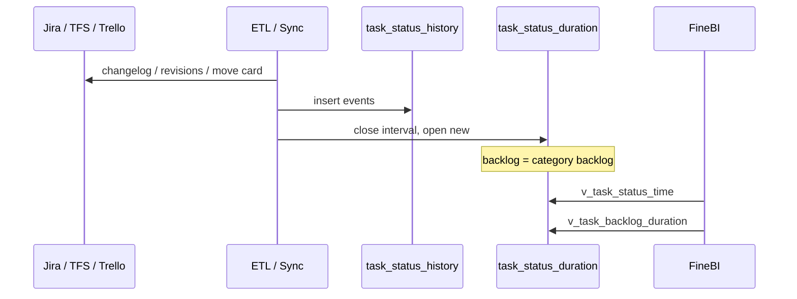

# Диаграммы проекта reporting

Все схемы в одном месте. **На GitHub** диаграммы Mermaid ниже отображаются прямо в браузере — откройте этот файл в репозитории, PlantUML не нужен.

**Прямая ссылка:** [github.com/volchonok16/reporting/blob/main/docs/diagrams.md](https://github.com/volchonok16/reporting/blob/main/docs/diagrams.md)

| Раздел | Тип | Исходник |
|--------|-----|----------|
| [Архитектура](#архитектура) | Mermaid | [plantuml/architecture.puml](../plantuml/architecture.puml) |
| [Production](#production-nginx--certbot) | Mermaid | [deploy/DEPLOY.md](../deploy/DEPLOY.md) |
| [Синхронизация TFS](#синхронизация-tfs-зни) | Mermaid | backend `sync_service.py` |
| [ER — база данных](#er--база-данных) | Mermaid | [plantuml/database-er.puml](../plantuml/database-er.puml) |
| [Use Case](#use-case) | Mermaid | [plantuml/use-case.puml](../plantuml/use-case.puml) |
| [Классы](#диаграмма-классов) | Mermaid | [docs/uml-diagram.md](uml-diagram.md) |
| [Поток данных](#поток-данных-время-в-статусе) | Mermaid | [docs/uml-diagram.md](uml-diagram.md) |
| [PlantUML (детальные SVG)](#plantuml--детальные-диаграммы) | SVG | генерируются при push / локально |

---

## Архитектура

Веб-приложение reporting: TFS (ЗНИ + Ошибки) → FastAPI sync → PostgreSQL → Vite UI + CSV. Production — nginx + Let's Encrypt на **pallink.fun**.



---

## Production: nginx + certbot



Запуск: `sudo bash scripts/production.sh` · Конфиги: `deploy/nginx/` · Подробнее: [deploy/DEPLOY.md](../deploy/DEPLOY.md)

---

## Синхронизация TFS (ЗНИ)

Оптимизированный поток (без тяжёлого `$expand`):



**Доски:** Digital Streams B2b (`Tele2\Digital\Streams\B2b`), BE-T2 Team (`BE-T2`). Фильтр «Все доски» — объединение.

---

## ER — база данных

Основные таблицы и связи единой БД (включая веб-приложение).



Полный глоссарий полей: [glossary.md](glossary.md)

---

## Use Case



Подробная таблица use cases: [use-case-diagram.md](use-case-diagram.md)

---

## Диаграмма классов



---

## Поток данных: время в статусе



---

## PlantUML — детальные диаграммы

Детальные схемы с полным набором таблиц и полей. **SVG** обновляются при push в `main` (GitHub Actions) или локально:

```bash
docker run --rm -v "$(pwd):/work" -w /work plantuml/plantuml \
  -tsvg -o /work/docs/diagrams/svg \
  /work/plantuml/database-er.puml \
  /work/plantuml/architecture.puml \
  /work/plantuml/use-case.puml
```

| Диаграмма | SVG (в репозитории) | Исходник |
|-----------|---------------------|----------|
| ER база данных | [database-er.svg](diagrams/svg/database-er.svg) | [database-er.puml](../plantuml/database-er.puml) |
| Архитектура | [architecture.svg](diagrams/svg/architecture.svg) | [architecture.puml](../plantuml/architecture.puml) |
| Use Case | [use-case.svg](diagrams/svg/use-case.svg) | [use-case.puml](../plantuml/use-case.puml) |

> Если SVG ещё не сгенерированы — откройте любой `.puml` на [plantuml.com/plantuml](https://www.plantuml.com/plantuml/uml) или дождитесь workflow **Render diagrams** во вкладке Actions.

### Просмотр без GitHub

1. **В репозитории** — этот файл (`diagrams.md`), Mermaid рисуется сам.
2. **PlantUML онлайн** — скопировать текст из `plantuml/*.puml` → [plantuml.com](https://www.plantuml.com/plantuml/uml).
3. **Локально** — см. [plantuml/README.md](../plantuml/README.md).
