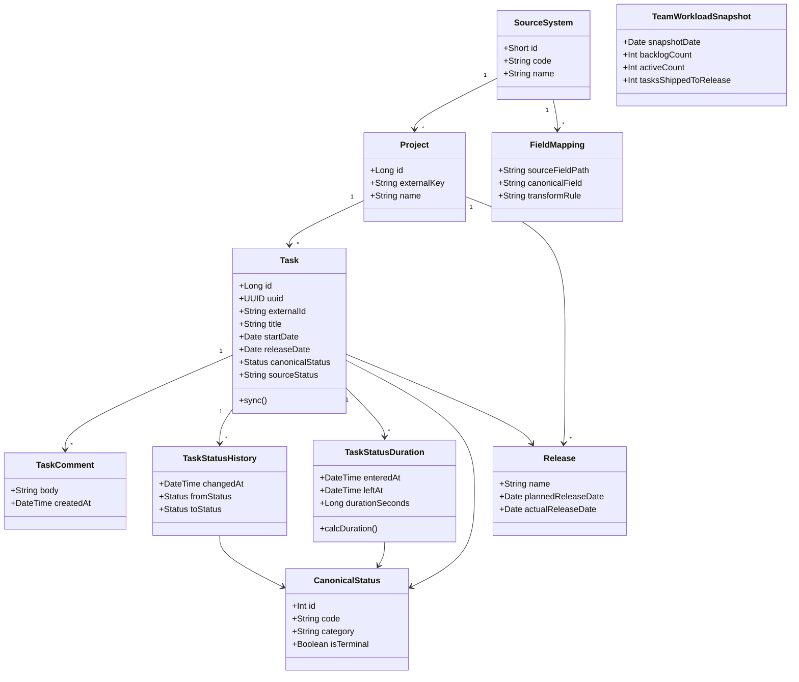
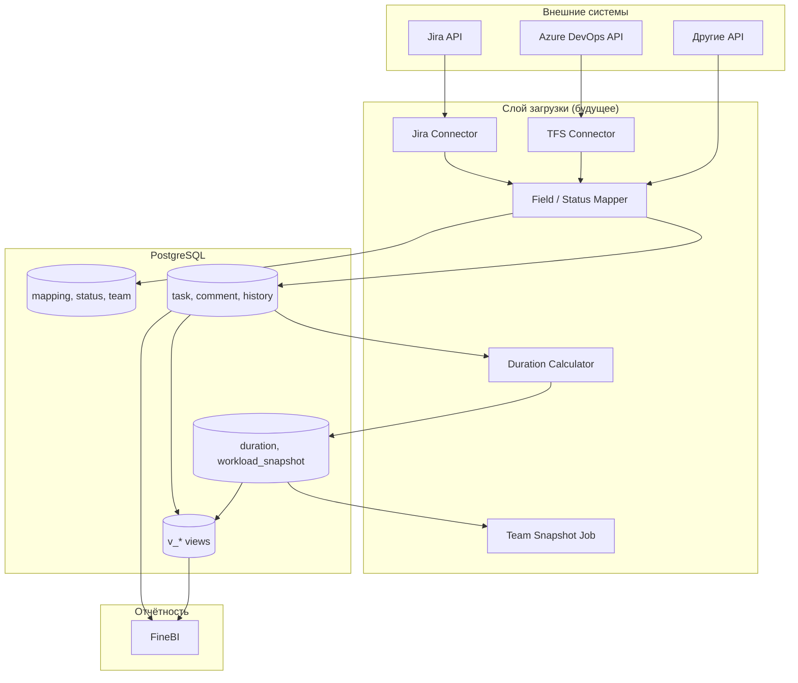
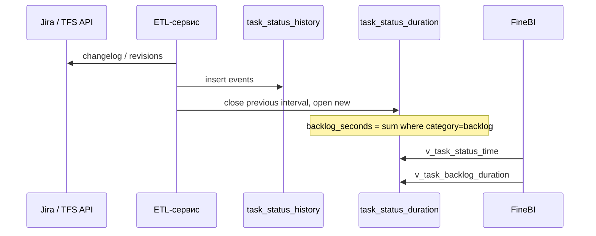

# UML — ER-диаграмма и компоненты

## ER-диаграмма (Mermaid)

```mermaid
erDiagram
    source_system ||--o{ project : has
    source_system ||--o{ task : originates
    source_system ||--o{ field_mapping : maps
    source_system ||--o{ source_status_mapping : maps
    source_system ||--o{ sync_run : logs

    team ||--o{ project : owns
    team ||--o{ team_workload_snapshot : measured

    project ||--o{ task : contains
    project ||--o{ release : ships

    canonical_status ||--o{ source_status_mapping : target
    canonical_status ||--o{ task : current
    canonical_status ||--o{ task_status_history : transition
    canonical_status ||--o{ task_status_duration : interval

    person ||--o{ person_external : linked
    person ||--o{ task : assignee
    person ||--o{ task_comment : author

    task ||--o{ task_comment : has
    task ||--o{ task_status_history : changelog
    task ||--o{ task_status_duration : time_in_status
    task ||--o{ task_status_duration_agg : agg
    task ||--o{ task_assignee_history : ownership
    task ||--o{ task_release : versions
    task |o--o| task : parent_child

    release ||--o{ task : primary_release
    release ||--o{ task_release : many
    release ||--o{ team_workload_snapshot : shipped

    task {
        bigint id PK
        uuid uuid UK
        varchar external_id
        varchar title
        date start_date
        date release_date
        jsonb extra_json
    }

    task_status_duration {
        bigint id PK
        timestamptz entered_at
        timestamptz left_at
        bigint duration_seconds
        boolean is_current
    }

    task_comment {
        bigint id PK
        text body
        timestamptz created_at
    }

    field_mapping {
        varchar source_field_path
        varchar canonical_field
    }
```

## Диаграмма классов (логическая модель)



## Диаграмма компонентов (целевая архитектура)



## Поток данных: время в статусе



## Связь с файлами

| Артефакт | Файл |
|----------|------|
| **Все диаграммы в браузере** | [diagrams.md](diagrams.md) |
| DDL PostgreSQL | `db/schema.sql` |
| Глоссарий | [glossary.md](glossary.md) |
| План | [plan.md](plan.md) |
