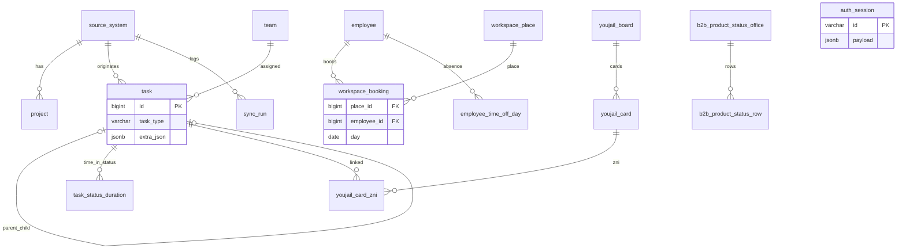
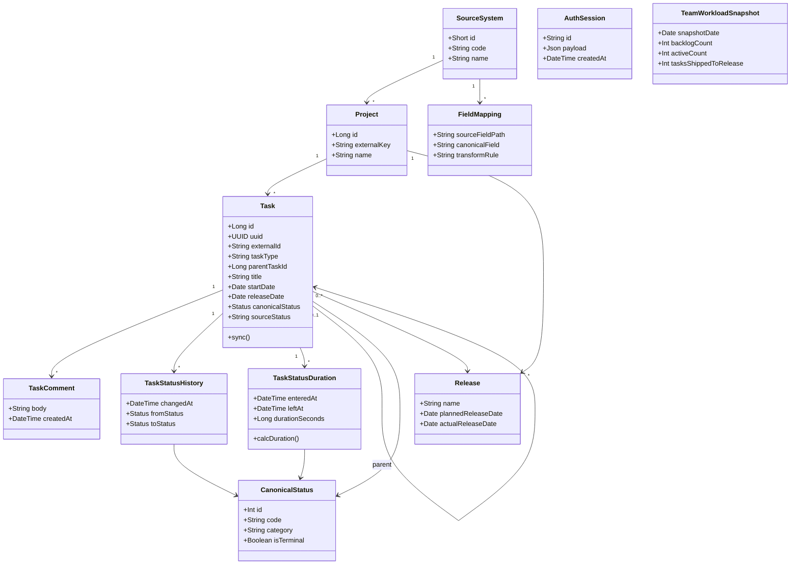
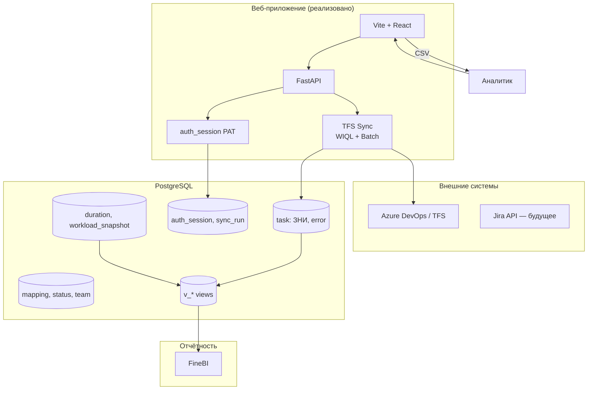
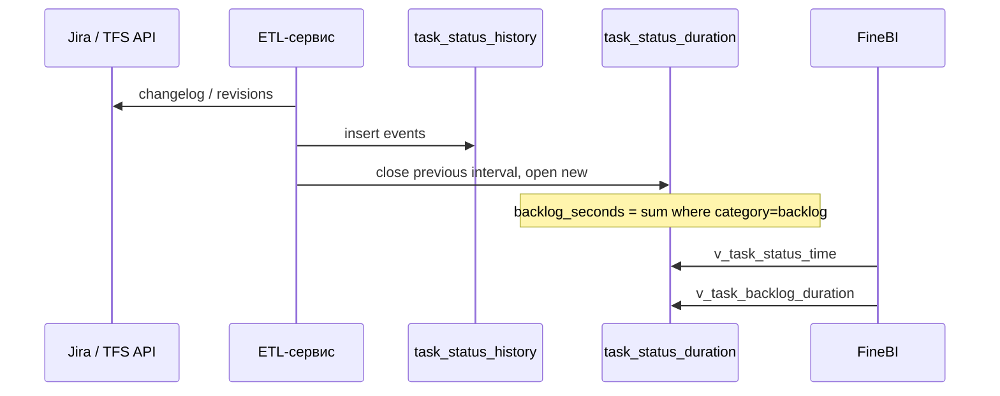

# UML — ER-диаграмма и компоненты

> Актуальная полная картина workbook: [diagrams.md](diagrams.md) (architecture, use case, ER с Staffing / YouJail / B2B).

## ER-диаграмма (Mermaid)

## Диаграмма классов (логическая модель)

## Диаграмма компонентов

## Поток данных: время в статусе

## Связь с файлами

| Артефакт | Файл |
|----------|------|
| **Все диаграммы в браузере** | [diagrams.md](diagrams.md) |
| DDL PostgreSQL | `db/schema.sql` |
| Глоссарий | [glossary.md](glossary.md) |
| План | [plan.md](plan.md) |
