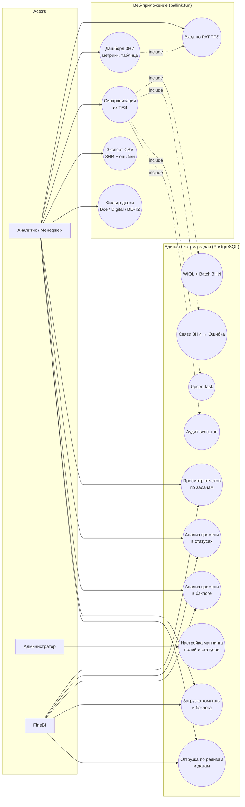

# Use Case Diagram — система учёта задач

## Диаграмма (Mermaid)

## Краткое описание use cases

### Веб-приложение ЗНИ

| ID | Use Case | Актор | Описание |
|----|----------|-------|----------|
| UC_AUTH | Вход по PAT TFS | Аналитик | PAT сохраняется в `auth_session`; клиент получает `sessionId` |
| UC_DASH | Дашборд ЗНИ | Аналитик | KPI: всего, скоро запуск, запущено, ошибок; таблица с поиском и сортировкой |
| UC_SYNC | Синхронизация TFS | Аналитик | WIQL → batch ЗНИ → WIQL связи → batch ошибок; аудит в `sync_run` |
| UC_EXPORT | Экспорт CSV | Аналитик | Только ЗНИ и связанные ошибки по выбранной доске |
| UC_BOARD | Фильтр доски | Аналитик | «Все доски», Digital Streams B2b, BE-T2 Team |

### Отчётность и ETL (единая БД)

| ID | Use Case | Актор | Описание |
|----|----------|-------|----------|
| UC1 | Просмотр отчётов по задачам | Аналитик, FineBI | Что сделано / в работе / запланировано |
| UC2 | Анализ времени в статусах | Аналитик, FineBI | Сколько задача была в In Progress, Review и т.д. |
| UC3 | Анализ времени в бэклоге | Аналитик, FineBI | Метрика «застоя» до начала работ |
| UC4 | Загрузка команды и бэклога | Аналитик, FineBI | Открытые задачи, story points, размер бэклога |
| UC5 | Отгрузка по релизам и датам | Аналитик, FineBI | Сколько задач ушло в релиз / на дату |
| UC6 | Настройка маппинга | Администратор | `field_mapping`, `source_status_mapping`, `source_team_mapping` |
| UC9A–C | Выгрузка из TFS | Sync Service | Оптимизированный batch без `$expand` Relations |
| UC16 | Аудит синхронизаций | Sync, Админ | `sync_run`, `sync_run_log` |

## PlantUML (экспорт в SVG)

Исходник: [plantuml/use-case.puml](../plantuml/use-case.puml) · SVG: [diagrams/svg/use-case.svg](diagrams/svg/use-case.svg)
