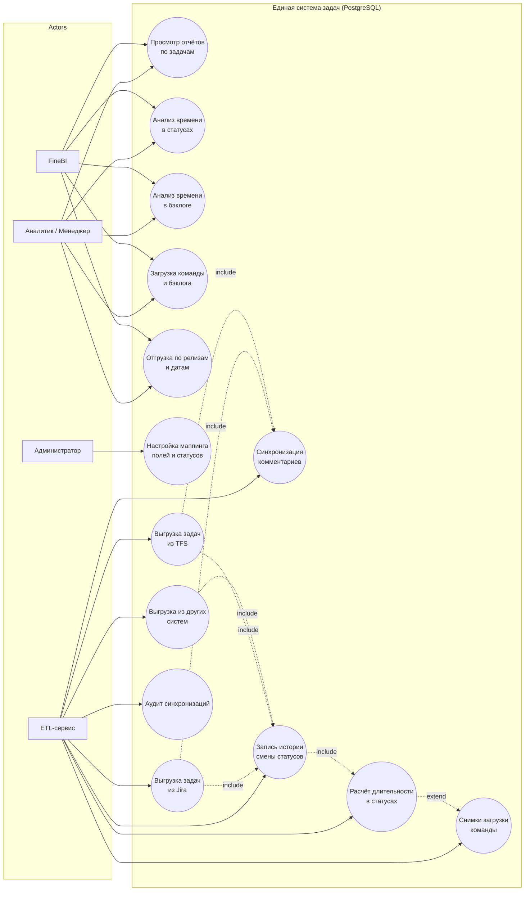
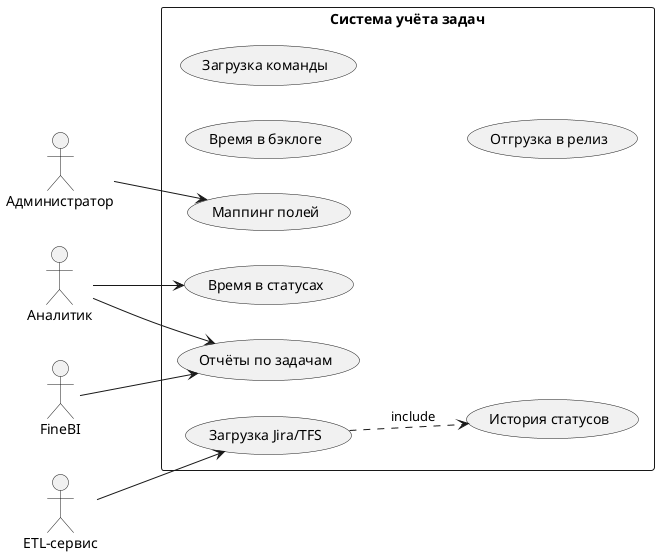

# Use Case Diagram — система учёта задач

## Диаграмма (Mermaid)

## Краткое описание use cases

| ID | Use Case | Актор | Описание |
|----|----------|-------|----------|
| UC1 | Просмотр отчётов по задачам | Аналитик, FineBI | Что сделано / в работе / запланировано |
| UC2 | Анализ времени в статусах | Аналитик, FineBI | Сколько задача была в In Progress, Review и т.д. |
| UC3 | Анализ времени в бэклоге | Аналитик, FineBI | Метрика «застоя» до начала работ |
| UC4 | Загрузка команды и бэклога | Аналитик, FineBI | Открытые задачи, story points, размер бэклога |
| UC5 | Отгрузка по релизам и датам | Аналитик, FineBI | Сколько задач ушло в релиз / на дату |
| UC6 | Настройка маппинга | Администратор | `field_mapping`, `source_status_mapping` |
| UC7–UC9 | Выгрузка из систем | ETL | API Jira, TFS, прочие |
| UC10 | Синхронизация комментариев | ETL | Таблица `task_comment` |
| UC11 | История статусов | ETL | `task_status_history` из changelog |
| UC12 | Расчёт длительности | ETL / job | `task_status_duration` |
| UC13 | Снимки загрузки | ETL / job | `team_workload_snapshot` |
| UC14 | Аудит синхронизаций | ETL, Админ | `sync_run`, `sync_run_log` |

## PlantUML (альтернатива для экспорта в draw.io)

