# Use Case Diagram — система reporting (полный workbook)

## Диаграмма (Mermaid)

```mermaid
flowchart TB
    subgraph Actors
        A1[Пользователь]
        A2[Администратор org]
        A4[FineBI]
    end

    subgraph Auth["Вход и профиль"]
        UC_AUTH((Вход PAT /\nemail+пароль))
        UC_PROFILE((Личный кабинет))
    end

    subgraph ZNI["ЗНИ"]
        UC_DASH((Дашборд ЗНИ))
        UC_SYNC((Синхронизация TFS))
        UC_EXPORT((Экспорт CSV))
        UC_BOARD((Выбор доски))
    end

    subgraph B2B["Статус продукта B2B"]
        UC_B2B((Таблица статуса))
        UC_NEWS((Новости и запуски))
        UC_PPTX((Генерация PPTX))
    end

    subgraph Plans["Планы Digital"]
        UC_ROADMAP((Roadmap колбаски))
    end

    subgraph YJ["Доска YouJail"]
        UC_YJ((Kanban доски))
        UC_YJ_ZNI((Связь с ЗНИ))
    end

    subgraph Staff["Staffing"]
        UC_VAC((График отпусков))
        UC_BOOK((Бронь мест))
        UC_OFFICE((Сотрудники в офисе))
        UC_ORG((Состав / пирамида))
        UC_PHOTO((Фото → MinIO))
    end

    subgraph Diag["Диаграммы"]
        UC_DIAG((Конструктор UI))
    end

    subgraph BI["Отчётность BI"]
        UC2((Время в статусах))
        UC3((Время в бэклоге))
        UC4((Загрузка команды))
    end

    A1 --> UC_AUTH
    A1 --> UC_PROFILE
    A1 --> UC_DASH
    A1 --> UC_SYNC
    A1 --> UC_EXPORT
    A1 --> UC_BOARD
    A1 --> UC_B2B
    A1 --> UC_NEWS
    A1 --> UC_PPTX
    A1 --> UC_ROADMAP
    A1 --> UC_YJ
    A1 --> UC_YJ_ZNI
    A1 --> UC_VAC
    A1 --> UC_BOOK
    A1 --> UC_OFFICE
    A1 --> UC_ORG
    A1 --> UC_DIAG
    A1 --> UC_PHOTO

    A2 --> UC_ORG
    A2 --> UC_BOOK
    A2 --> UC_VAC
    A2 --> UC_PHOTO

    A4 --> UC2
    A4 --> UC3
    A4 --> UC4

    UC_DASH -.->|include| UC_AUTH
    UC_PPTX -.->|include| UC_B2B
```

Источник PlantUML: [plantuml/use-case.puml](../plantuml/use-case.puml) · свод в [diagrams.md](diagrams.md).

## Краткое описание use cases

### Вход и профиль

| ID | Use Case | Описание |
|----|----------|----------|
| UC_AUTH | Вход | PAT TFS или email/пароль (`org_user` / `APP_AUTH_*`) → `auth_session` |
| UC_PROFILE | Личный кабинет | Фото (MinIO), пароль, дни в офисе без места |

### ЗНИ

| ID | Use Case | Описание |
|----|----------|----------|
| UC_DASH | Дашборд ЗНИ | KPI, таблица, фильтры (`tag_group`, метрики) |
| UC_SYNC | Синхронизация TFS | WIQL → batch ЗНИ → связи → ошибки; `sync_run` |
| UC_EXPORT | Экспорт CSV | ЗНИ + связанные ошибки |
| UC_BOARD | Выбор доски | Digital, B2B Product, BE Analytics, ESB, «Все доски» |

### Статус продукта B2B

| ID | Use Case | Описание |
|----|----------|----------|
| UC_B2B | Таблица статуса | Офисы / строки `b2b_product_status_*`, история, снимки |
| UC_NEWS | Новости и запуски | `b2b_news_*` |
| UC_PPTX | Генерация презентации | `GET/POST /api/product-status/b2b/presentation` → PPTX |

### Планы Digital

| ID | Use Case | Описание |
|----|----------|----------|
| UC_ROADMAP | Roadmap | Колбаски: `extra_json.roadmap_priority`, `roadmap_comment` |

### Доска YouJail

| ID | Use Case | Описание |
|----|----------|----------|
| UC_YJ | Kanban | Доски, колонки, карточки, теги, комментарии, PTY |
| UC_YJ_ZNI | Связь с ЗНИ | `youjail_card_zni` → `task` |

### Staffing

| ID | Use Case | Описание |
|----|----------|----------|
| UC_VAC | График отпусков | `employee_time_off_day` |
| UC_BOOK | Бронь мест | `workspace_place` / `workspace_booking` |
| UC_OFFICE | Сотрудники в офисе | бронь + `employee_office_day` + отсутствия |
| UC_ORG | Состав / пирамида | отделы, сотрудники, `org_chart_layout` |
| UC_PHOTO | Фото сотрудника | MinIO bucket `photos` (`employee.photo_path`); fallback `ORG_UPLOADS_DIR` |

### Инфраструктура (связь с use cases)

| Ресурс | Кто использует |
|--------|----------------|
| MinIO | UC_PHOTO, профиль, Staffing |
| `YOUJAIL_WORKSPACE_DIR` | UC_YJ вложения / исполнения |
| `assets/Status.pptx` | UC_PPTX |
| PostgreSQL | данные B2B / org / YouJail / ЗНИ |
| FineBI ← PostgreSQL views | UC2–UC4 |

### Диаграммы

| ID | Use Case | Описание |
|----|----------|----------|
| UC_DIAG | Конструктор | Вкладка «Диаграммы» — UI-редактор схем |

### BI

| ID | Use Case | Описание |
|----|----------|----------|
| UC2–UC4 | Views FineBI | `v_task_status_time`, `v_task_backlog_duration`, `v_team_open_tasks` |
